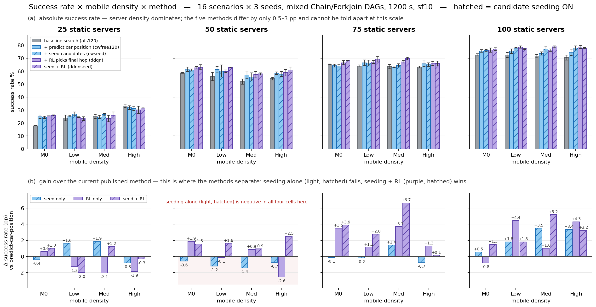

# 失败归因与候选补种 — 结果总览（2026-08-11 批次）

MobiEdgeSim 微服务放置实验的结果可视化。**互动版在这里：**

### 👉 https://wynn-th.github.io/msprov-results/  — 失败归因与候选补种（08-11 批次）
### 👉 https://wynn-th.github.io/msprov-results/dstep.html — 让 AI 管多少事（08-12 批次）

（悬停任意柱/点看精确数值；底部有全部 16 场景的数字表格；跟随系统深浅色。）

---

## 五种做法 — 一个比一个多一层

| | 人话名字 | 内部代号 | 加了什么 |
|---|---|---|---|
| 起点 | 基础搜索 | `afs120` | 试几百种放置组合，按"预计总耗时"挑最快的。不考虑车会开走 |
| +1 | + 预测车的位置 | `cwfree120` | 打分时加一项：预测结果算完时车开到哪段路，罩不住车的方案扣分 |
| +2 | + AI 挑收货点 | `ddqn` | "由哪台服务器把结果发回车上"这一个决定交给强化学习 |
| +3a | + 补齐候选名单 | `cwseed` | 把"够得着车、但搜索没配出可行方案"的服务器强制补进候选 |
| +3b | 补齐名单 + AI 挑 | `ddqnseed` | 两个新机制叠加 |

## 结果

16 种场景平均成功率：

```
基础搜索          54.0 %
+ 预测车的位置     56.5 %
+ AI 挑收货点     57.4 %
+ 补齐候选名单     57.0 %   ← 单独用，预注册判据未过（16 格只赢 7 格）
补齐名单 + AI 挑   58.5 %   ← 新最优
```

**核心发现：同一份补齐的候选名单，谁来挑差别巨大。** 在 50 台服务器那一组，
按"预计耗时"规则挑 → 四格全下降；交给 AI 挑 → 四格全上升。
名单补齐没有错，错的是按失真的耗时估计去挑。



## 机制证据

| | |
|---|---|
| 离线回放对账 | **7,812 / 7,812 = 100%** 与当时真实决策逐一吻合 |
| 补种后每请求"可行收货点"数 | 48 → 59（**+23%**） |
| 回放挑出的"必定翻转"案例 | **3 / 3** 全部翻转到预测的那台服务器 |

## 实验设置

- 16 种场景 = 固定服务器 25/50/75/100 台 × 车载服务器密度 无/低/中/高
- 每格 3 个随机种子；每次仿真约 500 个请求；车速档 sf10；仿真时长 1200 秒
- 每次仿真内 Chain 与 ForkJoin 两种任务形状各半
- 三个批次各 144 次仿真，跑在 TCD harris（192 核）

## 文件

| 文件 | 内容 |
|---|---|
| `index.html` | 互动版总览（上面的链接） |
| `fa_grouped_bars.png` | 分组柱状图：上排绝对成功率，下排相对现有方法的增益 |
| `preview_light/dark.png` | 互动版的静态截图 |
| `audit_fa_tier1.csv` | 每次仿真的请求下场构成（成功/拒绝/送不回来/没发出去等六类） |
| `audit_fa2_tier2.csv` | "送不回来"的三分类（够不着 / 没进名单 / 排序排后） |
| `audit_fa2_acc.csv`、`audit_fa3_acc.csv` | 每次仿真的成功率明细 |

数据为仿真结果，可自由复核。源码与完整实验记录在主仓库（未公开）。
